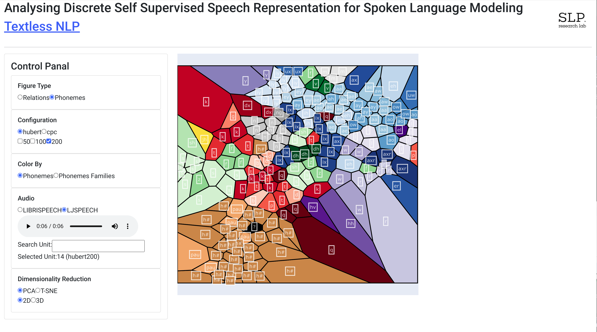

# SLM Discrete Representations

Implement the method described in the [Analysing Discrete Self Supervised Speech Representation for Spoken Language Modeling](https://arxiv.org/abs/2301.00591).

**Abstract**: This work profoundly analyzes discrete self-supervised speech representations through the eyes of Generative Spoken Language Modeling (GSLM). Following the findings of such an analysis, we propose practical improvements to the discrete unit
for the GSLM. First, we start comprehending these units by analyzing them in three axes: interpretation, visualization, and resynthesis. Our analysis finds a high correlation between the speech units to phonemes and phoneme families, while their correlation with speaker or gender is weaker. Additionally, we found redundancies in the extracted units and claim that one reason may be the units' context. Following this analysis, we propose a new, unsupervised metric to measure unit redundancies. Finally, we use this metric to develop new methods that improve the robustness of units' clustering and show significant improvement considering zero-resource speech metrics such as ABX.

## Online Interactive Research Tool:

[Link for the website](https://audio-lab.cs.huji.ac.il/units/)


### Supported configurations :
**Dense Models**: HuBERT, CPC

**Vocabulary Size**: 50, 100, 200


## Run Locally
To add new configurations (i.e., pre-trained model and vocabulary sizes), you must run the research tool locally. 
### Software
Requirements:
* [textlesslib](https://github.com/facebookresearch/textlesslib)
* Install dependencies
    ```
    git clone https://github.cs.huji.ac.il/adiyoss-lab/SLM-Discrete-Representations.git
    cd  SLM-Discrete-Representations
    pip install -r requirements.txt
    ```
### Data
The app uses three datasets:
1. **LJSPEECH**: you can download it manually from [here](https://keithito.com/LJ-Speech-Dataset/) into the "`datasets/LJSPEECH`" folder, else that the code will do it automatically during preprocessing. 
2. **LIBRISPEECH**: same as LJSpeech (download from [here](https://www.openslr.org/12) )
3. **TIMIT**:  download it manually from [here](https://catalog.ldc.upenn.edu/LDC93s1) into ```datasets/TIMIT```

### Run:
 

2. preprocess the data using "preprocess.py"
3. run the app using "main.py"

## Add new configuration:
#### Steps:
1. Add encoder model in "`preprocessing/encoders.py` "
2. Add the K-means model as binary file  to  ```assets/kmeans/km_{model_name}_{vocab}.bin```
3. [Run](#run)
#### Example:
To add LogMel dense model with a vocabulary size of 100. All we need to do is:
##### modify ```preprocessing/encoders.py```:

Add the LogMelEncoder :

```
class LogMelEncoder(Encoder):

    def __init__(self, vocab, num_mel_bins=80, frame_length=25.0):
        """
        Initializes the LogMel encoder with a vocabulary size and loads the model onto the device (GPU if available, otherwise CPU).
        """
        self.num_mel_bins = num_mel_bins
        self.frame_length = frame_length
        kmeans_file = f"assets/kmeans/km_logmel_{vocab}.bin"
        self.km = joblib.load(kmeans_file)

    def encode(self, waveform):
        """
        Encodes a waveform using the LogMel model and returns the resulting units as a NumPy array.
        """
        if not torch.is_tensor(waveform):
            waveform = torch.from_numpy(waveform).float()
        if len(waveform.shape) == 1:
            waveform = waveform.unsqueeze(0)

        feat = kaldi.fbank(
            waveform,
            num_mel_bins=self.num_mel_bins,
            frame_length=self.frame_length,
            sample_frequency=16_000,
        )
        units = np.argmin(self.km.transform(feat.cpu()), axis=1)
        return units
```

Update the ENCODERS dictionary:

```
ENCODERS = {
    'hubert': HuBERTEncoder,
    'cpc': CPCEncoder,
    'logmel': LogMelEncoder,
}
```

##### K-means model:

Download the pre-train K-means model from [here](https://github.com/facebookresearch/fairseq/tree/main/examples/textless_nlp/gslm/speech2unit) or train a new K-means model.
Copy the model as a binary file to assets/kmeans/km_logmel_100.bin

##### [Run the app](#run), and the new configuration will automatically add to the view.
